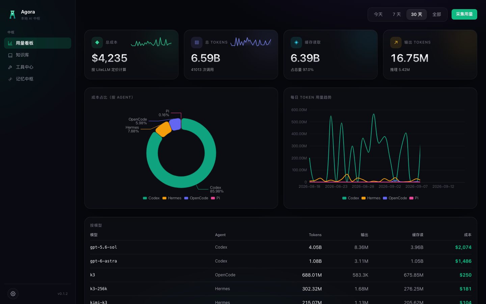
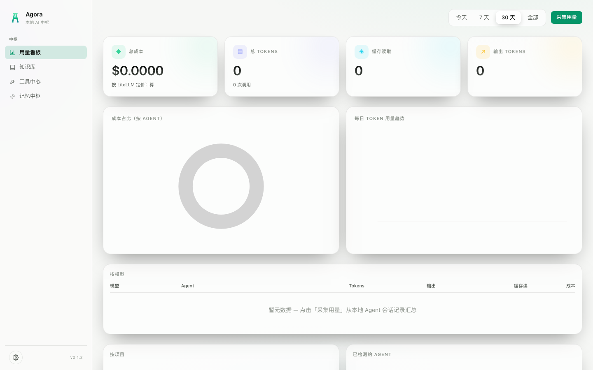
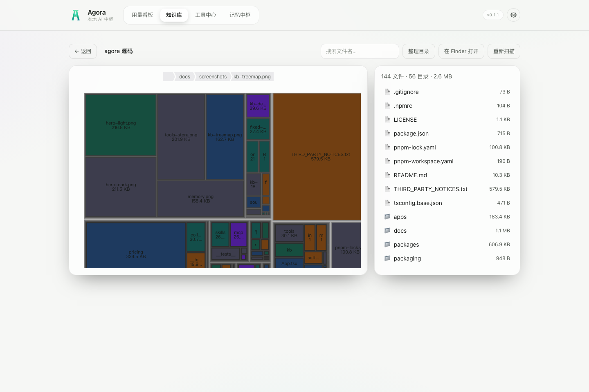
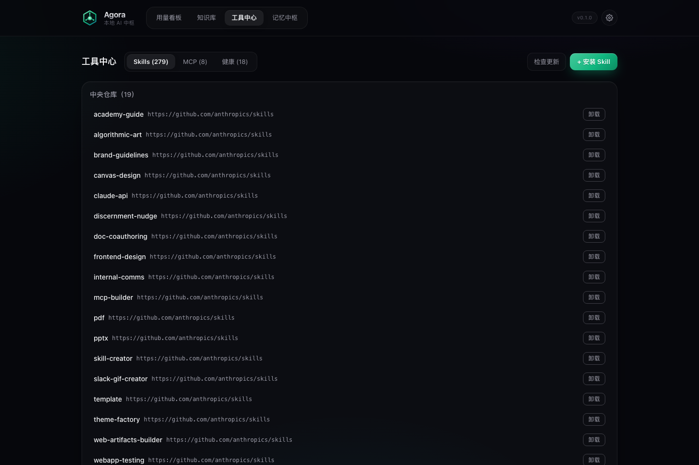
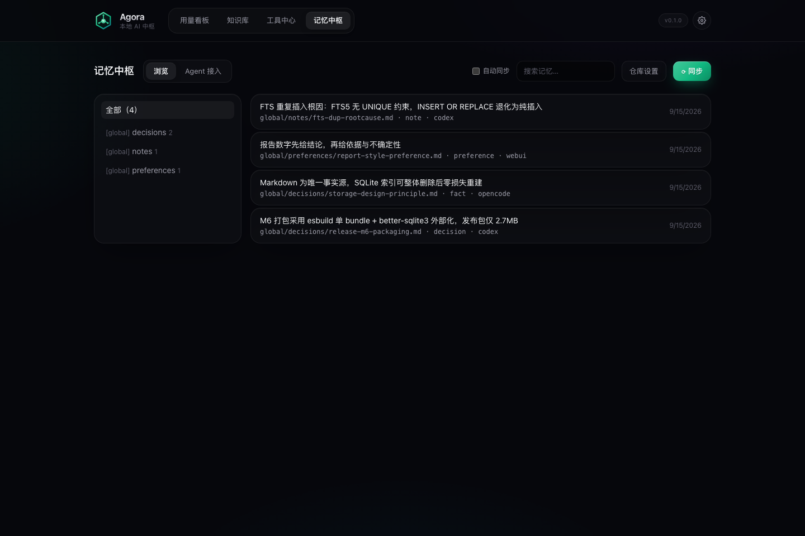
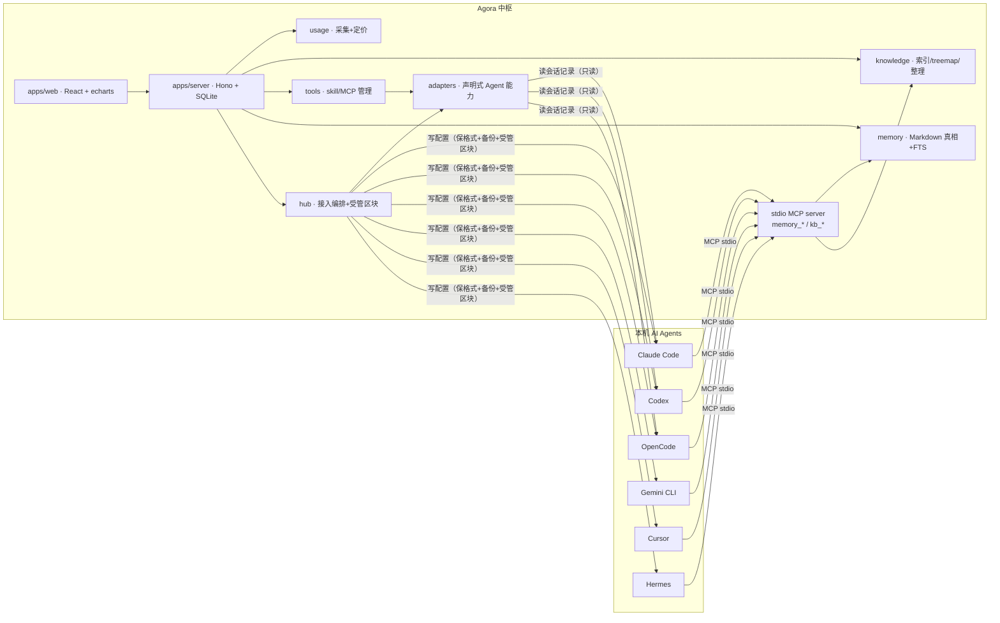

<p align="center">
  
</p>

<h1 align="center">Agora</h1>

<p align="center">
  <strong>本地 AI 中枢 —— 把你所有 AI Agent 的知识库、工具、记忆与用量，统一管起来。</strong><br/>
  Local-first hub for every AI agent on your machine: knowledge bases, skills & MCP servers, shared memory, and token usage — in one localhost app.
</p>

<p align="center">
  <a href="LICENSE"></a>
  
  
  
  
</p>

<p align="center">
  
</p>

---

## 为什么需要 Agora

如果你同时用着好几个 AI Agent（Claude Code、Codex、OpenCode、Gemini CLI、Cursor、Hermes、Pi……），这些场景一定不陌生：

- 🔀 **skill 散落四五个目录**，同一个 MCP 在三处重复注册，配置还互相不一致
- 🧱 **想让 Agent B 接着 Agent A 的上下文干活**，记忆却互不相通，只能靠复制粘贴
- 💸 **每月 token 烧了多少钱、烧在哪个模型哪个项目上**，心里完全没数
- 🗃 **笔记/wiki 越堆越乱**，想透视结构、按类型归置，却没有顺手工具

Agora 把它们收进**一个** localhost 页面。数据不出本机，默认只绑定 `127.0.0.1`，零遥测。

## ✨ 功能亮点

| 模块 | 能力 |
|---|---|
| 📊 **用量看板** | 从各 Agent 本地会话记录聚合 token 与成本（LiteLLM 定价，未定价模型诚实报 `$0`）。按 今天/7 天/30 天/全部 × Agent/模型/项目 透视，支持 USD/CNY/EUR/HKD（联网实时汇率，可手动覆盖） |
| 🗂 **知识库** | 注册或按模板新建目录 → **treemap 透视**（CleanMyMac 式钻取）+ 文件名搜索（FTS5 中文友好）+ 按类型整理（可撤销）+ 一键在 Finder 打开 |
| 🧰 **工具中心** | skill 统一视图 + 跨 Agent 开关矩阵（symlink 分发，**实体永不被移动**）；MCP 统一视图 + 配置漂移检测；官方 registry 市场一键安装；Git 安装 skill 到中央仓库并联网更新 |
| 🧠 **记忆中枢** | 一键同步各 Agent 的记忆到中央仓库（**Markdown 为唯一事实源**，SQLite 只是可删索引）；自动同步模式会写入同步规则到各 Agent 入口文件并定时汇聚 |
| ⚡ **开箱即采集** | 装完打开即有数据——app 启动自动建立 server 并后台采集各 Agent 历史用量，无需任何手动配置 |
| 🔌 **自动接入** | 把 Agora MCP server 注册进 Agent 配置 + 在入口文件注入使用指引（受管区块，全程可逆，写前自动 `.bak` 备份） |
| 🎨 **主题系统** | 跟随系统自动切换深浅色，深色 × 3 / 浅色 × 3 套皮肤，任意皮肤都可深链接分享 |

## 📸 界面一览

<p align="center">
  <br/>
  <em>浅色皮肤「纸白」· 同一块看板</em>
</p>

<p align="center">
  <br/>
  <em>知识库 treemap 透视 · 钻取、搜索、整理、一键在 Finder 打开</em>
</p>

<p align="center">
  <br/>
  <em>工具中心 · 中央仓库（从 GitHub 安装的 skill）与跨 Agent 开关矩阵</em>
</p>

<p align="center">
  <br/>
  <em>记忆中枢 · 跨 Agent 共享记忆，按来源（codex / opencode / webui）分组</em>
</p>

## 🚀 快速开始（macOS App，即装即用）

1. 下载 **[最新 release](https://github.com/stanshek/agora/releases)** 里的 `Agora_<版本>_aarch64.dmg`
2. 打开 dmg，把 **Agora.app** 拖进 `/Applications`
3. 在终端执行一次（清除下载隔离属性，只需一次）：

   ```bash
   xattr -c /Applications/Agora.app
   ```

4. 双击打开。**完成** —— app 会自动建立本地 server 并开始采集你的 Agent 用量，打开即有数据。

之后它常驻在**菜单栏**（关窗不退出）：左键图标可打开主界面、跳转用量看板/记忆中枢、或退出。数据全部在 `~/.agora/`（可用 `AGORA_HOME` 覆盖），零遥测。

> **开箱即采集**：app 启动即自动建立 server 并后台采集各 Agent 的历史用量，无需任何手动配置。
> **自动接入**：同时自动检测本地已装 Agent（Claude Code / Codex / OpenCode / Gemini CLI / Cursor / Hermes / Pi）并完成接入。

### 开发者 / 服务器场景（CLI 可选）

```bash
npm install -g agora-hub    # 要求 Node.js ≥ 22
agora                       # 启动 → http://127.0.0.1:7878
agora doctor                # 环境自检
```

从源码开发：

```bash
git clone https://github.com/stanshek/agora.git && cd agora
pnpm install
pnpm --filter @agora/web build     # 构建前端
pnpm --filter @agora/server dev    # → 打开 http://127.0.0.1:7878
```

前端热更新开发模式：`AGORA_DEV_ORIGIN=http://localhost:5173 pnpm dev`（Vite dev server 代理 API）。

打包分发包：`pnpm run pack`（bundle → tgz）；macOS app：`node scripts/prepare-sidecar.mjs && cd apps/desktop/src-tauri && cargo tauri build`（详见 [docs/distribution.md](docs/distribution.md)）。

## 🔌 Agent 接入（默认全自动）

**中枢启动时自动检测本地已安装的 Agent 并完成接入**（注册 MCP + 注入指引，幂等、自动备份）——零手动配置。也可以在「记忆中枢 → Agent 接入」里关闭自动接入或手动接入/断开。

| Agent | 配置格式 | 写入支持 | 说明 |
|---|---|---|---|
| Claude Code | JSON | ✅ | 保格式局部编辑 |
| Codex | TOML | ✅ | `[mcp_servers.*]` 段落行级手术，保护手维护的注释与格式 |
| OpenCode | JSONC | ✅ | `jsonc-parser` 注释保留写入 |
| Gemini CLI | JSON | ✅ | 保格式局部编辑 |
| Cursor | JSON | ✅ | 保格式局部编辑 |
| Hermes | YAML | ✅ | `mcp_servers:` 块级手术，嵌套结构完整保留 |
| Pi | JSON | ✅ | 保格式局部编辑（Pi 的 MCP 由用户自行安装 extension 消费） |

**写入纪律**：每次写前自动 `.bak-<时间戳>` 备份 + 原子替换（临时文件 rename）；入口文件（AGENTS.md / CLAUDE.md / SOUL.md）只增删**受管区块**（`BEGIN/END AGORA-MANAGED` 标记），用户手写内容永不被触碰；「断开」可干净还原。

## 🏗 架构



设计三原则：

1. **双向集成**：管理面读写各 Agent 配置文件（保格式 + 备份 + 原子替换）；运行面暴露 MCP server（`memory_search/read/write`、`kb_list/kb_search`，渐进披露省 token）
2. **诚实原则**：未定价模型成本报 `$0` 不虚构；扫描输出全程脱敏（URL token / env / headers 打码）；写操作只动自己管理的文件与区块
3. **索引即可删缓存**：知识库与记忆的 SQLite 索引都可整体删除后零损失重建（有测试强制保证）

## 🔐 安全与隐私

- **只绑定 127.0.0.1**（远程服务模式刻意未启用）；零遥测、零外发
- **DNS rebinding 防护**：Host / Origin 白名单校验 + 写请求必须携带显式标识头 + 写请求仅接受 `application/json`（系统测试覆盖）
- **路径安全**：所有文件操作强制 containment 校验，逃逸请求一律 400
- **脱敏默认开启**：API 输出中的 URL token、userinfo、`env`/`headers` 一律 `***`
- **可回滚**：任何配置写入都有 `.bak-<时间戳>` 备份；入口文件只动受管区块

## 🧪 测试

```bash
pnpm -r run test        # 116 个单测（解析器/fixture 驱动，含并发与回滚路径）
pnpm -r run typecheck
```

另有系统级测试（`apps/server/scripts/system-test.ts`，需运行中的 server）：**24 项**覆盖功能（全部端点形状校验）、性能（API p99 < 250ms 基线）、安全（DNS rebinding / 路径逃逸 / 脱敏 / 写边界）。

## 🗺 路线图

- [x] M1 用量统计（3 采集器 + LiteLLM 定价 + 看板）
- [x] M2 知识库（模板 / 索引 / treemap / 搜索 / 整理）
- [x] M3 工具管理（skill 矩阵 + MCP 统一视图 + 四种格式保格式写入）
- [x] M4 记忆中枢（Markdown 记忆 + MCP server + 一键接入）
- [x] M5 联网更新（Git 安装 + 更新检查 + 官方 registry 市场）
- [x] M6 打包分发（npm bin + esbuild 单 bundle + brew 模板）
- [x] 主题系统（自动/手动 × 6 皮肤）、实时汇率、一键记忆同步
- [x] Pi 适配器与用量采集器、**自动接入**（启动时自动检测并接入本地 Agent）
- [ ] brew tap 发布、Tauri macOS 壳（sidecar 方案已定）
- [ ] 更多采集器（Gemini CLI / Cursor / Aider）、registry 自建索引

## 📚 文档

- [使用说明与限制（apps/server/README.md）](apps/server/README.md)
- [分发指南（docs/distribution.md）](docs/distribution.md)
- [原始验收报告（docs/acceptance-2026-09-15/REPORT.md）](docs/acceptance-2026-09-15/REPORT.md)

## 🙏 致谢

- token 用量解析器与定价管道移植自 **[codeburn](https://github.com/getagentseal/codeburn)**（MIT，见 `packages/usage/LICENSE-codeburn`），并参考了 [tokscale](https://github.com/junhoyeo/tokscale) / [ccusage](https://github.com/ryoppippi/ccusage) 的各 Agent 数据位置清单
- 记忆架构理念受 **[agent-memory](https://github.com/tigerless-labs/agent-memory)**「Markdown 为唯一事实源」启发
- MCP 市场消费 **[modelcontextprotocol/registry](https://github.com/modelcontextprotocol/registry)** 官方 v0.1 API
- 定价数据来自 **[LiteLLM](https://github.com/BerriAI/litellm)**；汇率来自 **[frankfurter.app](https://www.frankfurter.app/)**（ECB 参考汇率）

## License

[MIT](LICENSE) © Agora contributors
